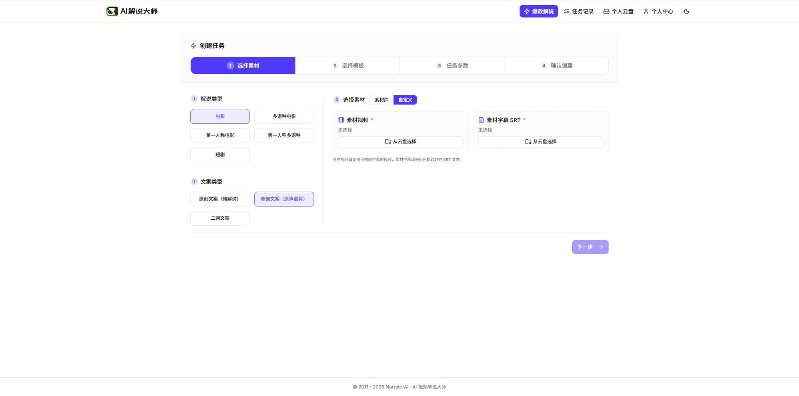

# narrator-ai-web-backend

[英文](./README.md)

面向模板化解说视频工作流的 Flask 后端，可自托管部署。它为定价报价、钱包交易、用户级任务存储、云盘代理、任务编排和上游解说服务代理提供 API 层。

配套前端在 `narrator-ai-web` 仓库。

## 在线演示

完整 Web 体验的托管演示地址：**https://app.jieshuo.cn/**。

## 页面截图

**自定义素材上传**



**模板选择**


## 功能特性

- Flask API server，静态 OpenAPI 合同见 [`openapi.json`](./openapi.json)
- 基于 Postgres 的钱包生命周期：quote、freeze、confirm、refund
- 面向模板工作流的定价目录和报价 API
- 用户级任务存储，以及长耗时解说任务编排
- 云盘上传、下载、转存、列表和删除代理路由
- 面向 BFF 的 Bearer token 鉴权（Authentication）保护钱包、定价、云盘和代理 API
- Alembic 数据库迁移和 pytest 测试套件

## 环境要求

- Python 3.11+
- Postgres 14+
- 与本仓代理路由兼容的上游解说 API
- 可选：Docker 24+，用于容器化本地运行

## 文档

| 文档 | 用途 |
|---|---|
| [部署指南](./docs/DEPLOYMENT_CN.md) | 本地、Docker、Fly.io 部署步骤 |
| [架构概览](./docs/ARCHITECTURE_CN.md) | 主要模块、请求流和数据边界 |
| [CI 与质量指南](./docs/CI_CN.md) | 测试、lint 和发布检查 |
| [安全策略](./SECURITY.md) | 私有漏洞报告流程 |
| [贡献指南](./CONTRIBUTING.md) | 分支、提交、PR 和本地质量规范 |

## 配置

复制 `.env.example` 为 `.env`，并按你的环境填入配置。

| 变量 | 用途 |
|---|---|
| `DATABASE_URL` | Postgres DSN。设置后优先生效。 |
| `NARRATOR_DB_HOST` / `NARRATOR_DB_PORT` / `NARRATOR_DB_USER` / `NARRATOR_DB_PASSWORD` / `NARRATOR_DB_NAME` | 未设置 `DATABASE_URL` 时使用的 Postgres 连接配置。 |
| `OPEN_FASTAPI_BASE` | 上游解说 API 的基础 URL。 |
| `OPEN_FASTAPI_APP_KEY` | 后端代理上游请求使用的服务端 API key。 |
| `WALLET_BFF_AUTH_TOKEN` | `/wallet/*` 路由要求的 Bearer token。 |
| `PRICING_BFF_AUTH_TOKEN` | 定价、云盘、narrator-metadata、narrator-proxy 和 admin 路由要求的 Bearer token。 |
| `PORT` | HTTP 端口，默认 `8080`。 |

完整变量列表见 [`.env.example`](./.env.example) 的内联注释。

## 快速开始

```bash
git clone <repo-url> narrator-ai-web-backend
cd narrator-ai-web-backend

python -m venv .venv
source .venv/bin/activate
pip install -r requirements.txt

cp .env.example .env
# 编辑 .env，填入本地 Postgres、BFF token 和上游 API 配置。

alembic upgrade head
python server.py
```

服务监听 `PORT`，默认 `8080`。

检查服务：

```bash
curl http://localhost:8080/health
curl http://localhost:8080/ready
curl http://localhost:8080/openapi.json
```

## Docker

公开 Linux 镜像已发布到阿里云容器镜像服务：

| Tag | 用途 |
|---|---|
| `registry.cn-hangzhou.aliyuncs.com/narrator-ai/public:backend-latest` | 最新公开后端镜像 |
| `registry.cn-hangzhou.aliyuncs.com/narrator-ai/public:backend-0.1.0-eae5acf` | 从 `docs/public` commit `eae5acf` 构建的固定版本后端镜像 |

两个 tag 都是 `linux/amd64` 架构。由于前端和后端共用同一个镜像仓库，本项目使用带组件名前缀的 tag，而不是共用单个 `latest` tag。

拉取镜像：

```bash
docker pull --platform linux/amd64 registry.cn-hangzhou.aliyuncs.com/narrator-ai/public:backend-latest
```

使用可访问的 Postgres 数据库和上游解说 API 运行：

```bash
docker run --rm --platform linux/amd64 -p 8080:8080 \
  -e DATABASE_URL='postgres://<username>:<password>@<host>:5432/<database>' \
  -e OPEN_FASTAPI_BASE='https://api.example.com' \
  -e OPEN_FASTAPI_APP_KEY='<upstream-api-key>' \
  -e WALLET_BFF_AUTH_TOKEN='<wallet-bff-token>' \
  -e PRICING_BFF_AUTH_TOKEN='<pricing-bff-token>' \
  registry.cn-hangzhou.aliyuncs.com/narrator-ai/public:backend-latest
```

检查运行状态：

```bash
curl http://localhost:8080/health
curl http://localhost:8080/openapi.json
```

后端启动后，前端镜像需要设置 `NARRATOR_PRICING_API_URL=http://host.docker.internal:8080`，这样同一台机器上的另一个 Docker 容器才能访问本服务。

如果需要固定到已验证版本：

```bash
docker run --rm --platform linux/amd64 -p 8080:8080 \
  -e DATABASE_URL='postgres://<username>:<password>@<host>:5432/<database>' \
  -e OPEN_FASTAPI_BASE='https://api.example.com' \
  -e OPEN_FASTAPI_APP_KEY='<upstream-api-key>' \
  -e WALLET_BFF_AUTH_TOKEN='<wallet-bff-token>' \
  -e PRICING_BFF_AUTH_TOKEN='<pricing-bff-token>' \
  registry.cn-hangzhou.aliyuncs.com/narrator-ai/public:backend-0.1.0-eae5acf
```

需要修改源码时，请本地构建：

```bash
docker build -t narrator-ai-web-backend:local .
```

使用可访问的 Postgres 数据库运行本地构建镜像：

```bash
docker run --rm -p 8080:8080 \
  -e DATABASE_URL='postgres://<username>:<password>@<host>:5432/<database>' \
  -e OPEN_FASTAPI_BASE='https://api.example.com' \
  -e OPEN_FASTAPI_APP_KEY='<upstream-api-key>' \
  -e WALLET_BFF_AUTH_TOKEN='<wallet-bff-token>' \
  -e PRICING_BFF_AUTH_TOKEN='<pricing-bff-token>' \
  narrator-ai-web-backend:local
```

当前 `Dockerfile` 使用 `python server.py` 启动 Flask 应用，并暴露 `8080` 端口。

## 数据库迁移

启动应用前先执行迁移：

```bash
alembic upgrade head
```

需要回滚一个迁移时：

```bash
alembic downgrade -1
```

生产部署建议把迁移作为发布步骤，在新版本接入流量前完成。

## 测试

```bash
pytest
```

如果当前环境安装了 `ruff`，可选执行：

```bash
ruff check .
```

## 核心 API

完整 API 见 [`openapi.json`](./openapi.json)。

| Method | Path | 描述 |
|---|---|---|
| `GET` | `/health` | 存活检查 |
| `GET` | `/ready` | 带数据库检查的 readiness |
| `GET` | `/metrics` | Prometheus metrics |
| `GET` | `/openapi.json` | OpenAPI 合同 |
| `POST` | `/pricing/hard-price` | 按 `template_id` 和 `combo_key` 查询模板价格 |
| `GET` | `/pricing/hard-price/all?template_id=N` | 查询某个模板的全部模板价格档位 |
| `POST` | `/pricing/quote` | 创建服务端报价 |
| `POST` | `/wallet/quotes` | 固化服务端审核过的 quote |
| `POST` | `/wallet/freezes` | 冻结 quote 金额 |
| `POST` | `/wallet/confirms` | 确认冻结交易 |
| `POST` | `/wallet/refunds` | 退款或释放冻结交易 |
| `GET` | `/wallet/transactions/{wallet_transaction_id}` | 查询钱包交易 |
| `GET` | `/narrator/tasks` | 列出当前认证用户的任务 |
| `POST` | `/narrator/tasks` | 创建或 upsert 任务 |
| `POST` | `/cloud-drive/files/upload/presigned-url` | 创建云盘上传 URL |

`hard-price` 是为保持 API 兼容而保留的历史路径片段。在文档语境中，它等同于“模板价格”。

## 典型流程

1. 前端认证到后端，并在需要的路由上传入终端用户 app key。
2. 用户通过云盘代理上传或引用源素材。
3. 前端请求后端对所选模板工作流进行报价。
4. 后端校验请求、持久化 quote，并返回服务端审核过的金额。
5. 前端在启动长耗时任务前冻结钱包余额。
6. 后端存储任务状态，并可通过 orchestrator 推进符合条件的任务。
7. 任务成功后确认钱包交易，失败时执行退款或释放冻结。

## 项目结构

```text
server.py                  Flask app、路由装配、健康检查、OpenAPI 输出
account/                   账户信息格式化
cloud_drive/               云盘代理 schema、上游 client、本地存储
db/                        共享 SQLAlchemy 表元数据
finance/                   对账辅助逻辑
migrations/                Alembic 数据库迁移
narrator_metadata/         只读上游元数据代理路由
narrator_proxy/            解说任务上游代理路由
narrator_tasks/            用户级任务 schema 和持久化
orchestrator/              后台任务推进
pricing/                   模板价格 v1 endpoint 和辅助逻辑
pricing_catalog_v2/        定价目录持久化与校验
pricing_quote_v2/          quote 生成和快照逻辑
scripts/                   本地维护和迁移辅助脚本
tests/                     pytest 测试套件
users/                     终端用户 key 和资料管理
wallet/                    钱包生命周期实现
```

## 联系方式

项目问题请通过本仓 GitHub issues 或 discussions 交流。也可以使用下面的项目联系二维码。

Tips：如有大批量需求、技术项支持请求，可通过同一渠道联系我们。


## License

Apache License 2.0。见 [LICENSE](./LICENSE)。

## Contributing

见 [CONTRIBUTING.md](./CONTRIBUTING.md)。

## Security

不要通过公开 issue 报告漏洞。请通过 security@gridltd.com 私下报告，详见 [SECURITY.md](./SECURITY.md)。
